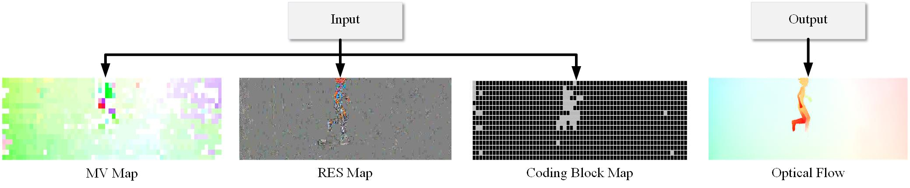

# COFlow
This is a deep learning framework for optical flow estimation that exclusively leverages coding information., for example:



## Setup

### Prerequisites
- Linux
- NVIDIA 3090GPU + CUDA 11.0

### Environmental configuration
- Here are some main environments and versions.
```bash
# Core framework
torch==1.12.1
torchvision==0.13.1

# Image processing
numpy==1.23.5
pillow==9.5.0
scikit-image==0.19.3
opencv-python==4.8.1.78
imageio==2.31.1

# Visualization
visdom==0.2.4
dominate==2.8.0
matplotlib==3.7.2

# Toolbox
tqdm==4.66.1
requests==2.31.0
scipy==1.11.2
```

## Train
```bash
python train.py --dataroot ./datasets/yourdataset_train --floroot ./datasets/yourflow_train --name tran  --gpu_ids 0,1
```

## Test
```bash
python test.py --dataroot ./datasets/yourdataset_test --floroot ./datasets/yourflow_test --name test  --gpu_ids 0,1
```

## Datasets
Download the datasets using the following script. Some of the datasets are collected by other researchers. Please cite their papers if you use the data.
- `Flyingchairs`: (wget https://lmb.informatik.uni-freiburg.de/resources/datasets/FlyingChairs/FlyingChairs_train_val.txt).
- `stinal`: (http://sintel.is.tue.mpg.de/).
- `KITTI 2012`: ([wget https://lmb.informatik.uni-freiburg.de/resources/datasets/FlyingChairs/FlyingChairs_train_val.txt](http://www.cvlibs.net/datasets/kitti/eval_stereo_flow.php?benchmark=flow)).
- `KITTI 2015`: ([wget https://lmb.informatik.uni-freiburg.de/resources/datasets/FlyingChairs/FlyingChairs_train_val.txt](http://www.cvlibs.net/datasets/kitti/eval_scene_flow.php?benchmark=flow)).
